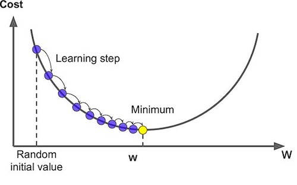

# NN and DL

#### Logistic Regression

In Logistic regression, we want to train the parameters `w` and `b`, we need to define a cost function.

, where .png>)\
Given .png>), we want .png>)

The loss function measures the discrepancy between the prediction (𝑦̂(𝑖)) and the desired output (𝑦(𝑖)). In other words, the loss function computes the error for a single training example.

<figure><figcaption></figcaption></figure>

The cost function is the average of the loss function of the entire training set. We are going to find the parameters 𝑤 𝑎𝑛𝑑 𝑏 that minimize the overall cost function

<figure><figcaption></figcaption></figure>

The loss function measures how well the model is doing on the single training example, whereas the cost function measures how well the parameters w and b are doing on the entire training set.


#### Gradient Descent

1. Start calculating the cost and gradient for the given training set of (x,y) with the parameters w and b.
2. update parameters w and b with pre-set learning rate: w\_new =w\_old – learning\_rate \* gradient\_of\_at(w\_old) Repeat these steps until you reach the minimal values of cost function.

#### Vectorization

Both GPU and CPU have parallelization instructions. They're sometimes called SIMD instructions, which stands for a single instruction multiple data. The rule of thumb to remember is whenever possible avoid using explicit four loops.

Broadcasting:

<figure><figcaption></figcaption></figure>

Explanation of logistic regression cost function

But so to summarize, by minimizing this cost function J(w,b) we're really carrying out maximum likelihood estimation with the logistic regression model because minimizing the loss corresponds to maximizing the log of the probability..png>).png>)

#### Shallow neural networks

<figure><figcaption><p>computation grpahs</p></figcaption></figure>

Neural network representation

<figure><figcaption></figcaption></figure>

Activation functions

<figure><figcaption></figcaption></figure>

Initialization of parameters:

```python
W[1] = np.random.randn((n1,nx)) * 0.01  # randomized small numbers
b[1] = np.zeros((n1,1))                 # zeros is fine for bias terms
W[2] = np.random.randn((n2,n1)) * 0.01
b[2] = np.zeros((n2,1))
```

Why randomized initialization?

In order to break the symmetry for hidden layers.

Imagine that you initialize all weights to the same value (e.g. zero or one). In this case, each hidden unit will get exactly the same signal. E.g. if all weights are initialized to 1, each unit gets signal equal to sum of inputs (and outputs sigmoid(sum(inputs))). If all weights are zeros, which is even worse, every hidden unit will get zero signal. No matter what was the input - if all weights are the same, all units in hidden layer will be the same too.

#### Deep Neural Network&#x20;

<figure><figcaption></figcaption></figure>

_Implementation steps_:

1. Initialize parameters / Define hyperparameters
2. Loop for num\_iterations:
   1. Forward propagation
   2. Compute cost function
   3. Backward propagation
   4. Update parameters (using parameters, and grads from backprop)
3. Use trained parameters to predict labels

**Forward and Backward Propagation**

In the algorithm implementation, outputting intermediate values as caches (basically `Z` and `A`) of each forward step is crucial for backward computation.

<figure><figcaption></figcaption></figure>

**Parameters vs Hyperparameters**

_Parameters_:

* weight matrices `W` of each layer
* bias terms `b` of each layer

_Hyper parameters_:

* number of hidden units `n[l]`
* learning rate
* number of iteration
* number of layers `L`
* choice of activation functions
